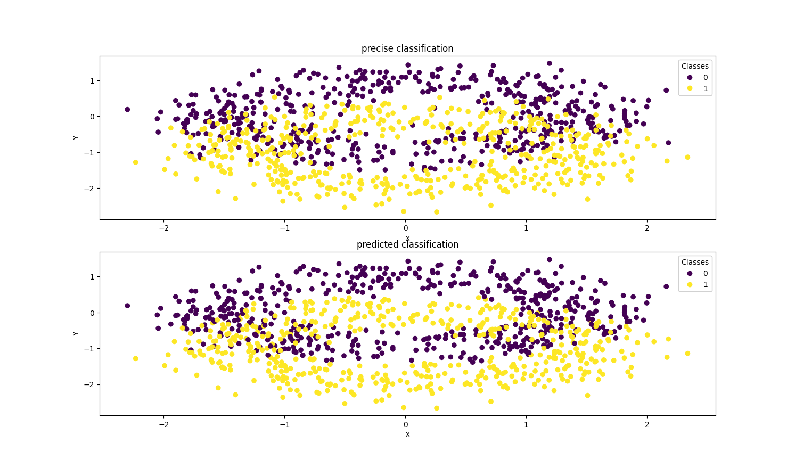

# <center>模式识别与机器学习第一次大作业报告

<center>学号：21375255     姓名：王鑫超</center>

## 一、任务要求

以下的程序生成了一个3D的数据集。一共有1000个数据，被分成了两大类：C0与C1。 请利用该数据做训练，同时利用程序新生成与训练数据同分布的500个数据（250个为C0类，250个数据为C1类）来做测试。

比较利用Logistic Regression, SVM与XGBoost的分类性能。并讨论对于这个问题，为什么某些算法表现相对更好。 其中SVM至少选用三种不同的Kernel Fucntions。


## 二、解决方案

### 1、Logistic regression

使用sklearn.linear_model库中的LogisticRegression函数构建模型，将源代码中的数据作为训练数据用于模型的训练，测试集的生成同样使用`make_moons_3d`函数，将其参数更改为`n_samples=500, noise=0.3`，核心代码如下：

```python {.line-numbers}
X, labels = make_moons_3d(n_samples=1000, noise=0.2)
X_test, labels_test = make_moons_3d(n_samples=500, noise=0.3)
model = LogisticRegression()
model.fit(X, labels)
Y_pred = model.predict(X_test)
accuracy = accuracy_score(labels_test, Y_pred)
print("Accuracy: {}".format(accuracy))
```

用训练好的模型进行测试，得到准确率为0.685，在X-Y平面上投影，对分类效果进行可视化，代码如下：

```python {.line-numbers}
fig = plt.figure()
ax1 = fig.add_subplot(211)
scatter1 = ax1.scatter(X_test[:, 0], X_test[:, 1], c=labels_test, cmap='viridis', marker='o')
legend1 = ax1.legend(*scatter1.legend_elements(), title="Classes")
ax1.add_artist(legend1)
ax1.set_xlabel('X')
ax1.set_ylabel('Y')
ax1.set_title("precise classification")
ax2 = fig.add_subplot(212)
scatter2 = ax2.scatter(X_test[:, 0], X_test[:, 1], c=Y_pred, cmap='viridis', marker='o')
legend2 = ax2.legend(*scatter2.legend_elements(), title="Classes")
ax2.add_artist(legend2)
ax2.set_xlabel('X')
ax2.set_ylabel('Y')
ax2.set_title("predicted classification")
plt.show()
```

效果如下：


### 2、SVM

使用`sklearn.svm`库中的`SVC`函数构造模型，其余内容同Logistic regression方法相同，分别使用`linear`、`poly`和`sigmoid`函数作为kernel函数。

```python {.line-numbers}
X, labels = make_moons_3d(n_samples=1000, noise=0.2)
X_test, labels_test = make_moons_3d(n_samples=500, noise=0.3)
# model = SVC(kernel='linear')
model = SVC(kernel='poly')
# model = SVC(kernel='sigmoid')
model.fit(X, labels)
Y_pred = model.predict(X_test)
accuracy = accuracy_score(labels_test, Y_pred)
print("Accuracy: {}".format(accuracy))
```

训练，测试得到准确率如下:

linear: 0.66
分类结果可视化：


poly: 0.84
分类结果可视化：


Sigmoid: 0.5625
分类结果可视化：


可以看出，在不同的`kernel`函数中，`poly`函数的效果最好，准确率最高，其余函数效果一般。

### 3、XGBoost

使用`xgboost`库中的`XGBClassifier`函数构建模型，其余与前文相同.

```python {.line-numbers}
X, labels = make_moons_3d(n_samples=1000, noise=0.2)
X_test, labels_test = make_moons_3d(n_samples=500, noise=0.3)
model = xgb.XGBClassifier(use_label_encoder=False, eval_metric='logloss')
model.fit(X, labels)
Y_pred = model.predict(X_test)
accuracy = accuracy_score(labels_test, Y_pred)
print("Accuracy: {}".format(accuracy))
```

得到准确率为： 0.917
分类结果可视化：


## 三、总结

从上述算法对比中可以发现，XGBoost算法的准确率最高，是一种高效的分类算法；而SVM算法在选择到合适的`kernel`函数下也有很好的分类效果，而Logistic regression算法的分类准确率较低，模型的预测效果并不够出色。
