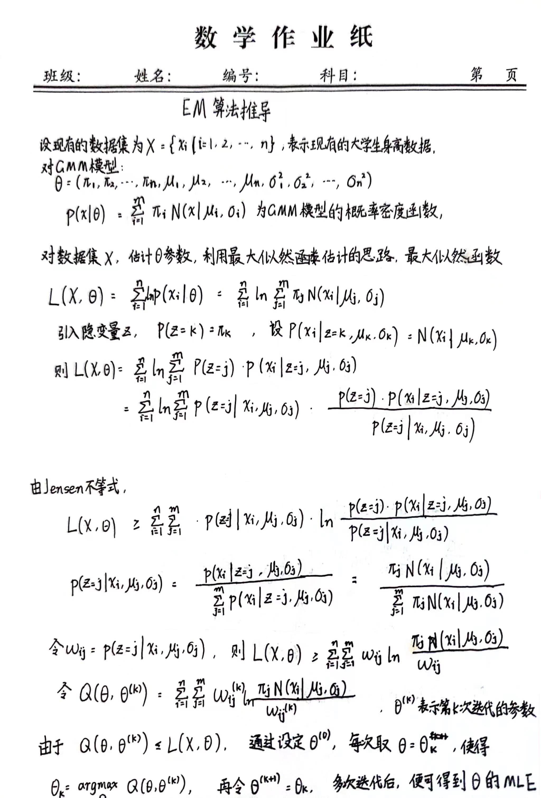
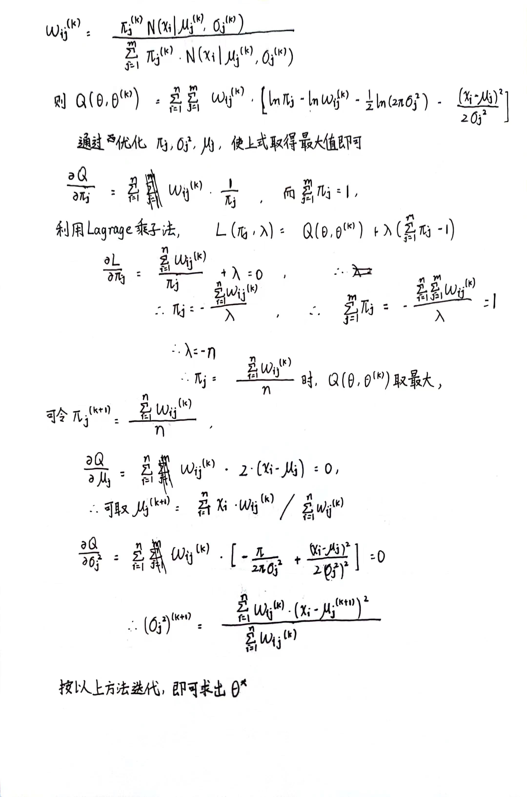
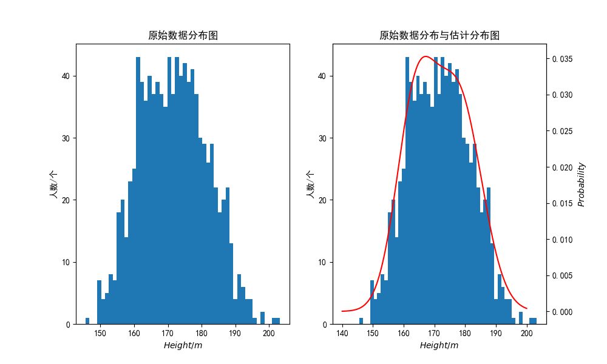

# <center> 第二次作业报告</center>

<center>学号：21375255 姓名：王鑫超</center>

### 一、GMM模型

高斯混合模型（Gaussian Mixture Model，GMM）是一种基于概率密度函数的聚类方法，它假设每个聚类都是由多个高斯分布组成的混合分布。GMM的目标是通过最大化似然函数来估计模型参数，包括每个高斯分布的均值、方差和混合系数，以及数据点属于每个聚类的概率。在聚类时，GMM将数据点分配到概率最大的聚类中，而不是像K-Means那样将数据点硬性分配到某个聚类中。GMM在许多应用中都表现出色，尤其是当数据点不是明显分离的时候。

GMM模型的优势在于：

* GMM可以处理复杂的数据分布，因为它可以用多个高斯分布来近似描述数据分布；
  
* GMM可以自适应地调整簇的数量和大小，从而更好地适应不同的数据分布；

* GMM可以用于生成新的数据样本

GMM模型的概率密度函数如下：

$p(x) = \sum_{i=1}^{n}\pi_iN(x|\mu_i,\sigma_i)$

其中$\sum_{i=1}^{n}\pi_i=1$

那么，要建立GMM模型，重点就在于如何估计模型中的$\pi、\mu、\sigma$参数。

### 二、EM算法

针对GMM模型的参数估计问题，可以引入EM算法进行解决。
最大期望算法（Expectation-maximization algorithm）在统计中被用于寻找，依赖于不可观察的隐性变量的概率模型中，参数的最大似然估计。

EM算法的通用步骤如下：
1、初始化模型参数
2、重复进行以下步骤直到收敛：

* E-step：根据参数的假设值，给出未知变量的期望估计，应用于缺失值。
* M步骤：根据未知变量的估计值，给出当前的参数的极大似然估计。

针对GMM模型，使用EM算法推导其模型参数的推导过程如下：




### 三、核心代码

依照上述的推导过程，设计GMM的参数估计函数，核心的代码如下：

```python {.line-numbers}
def EM_GMM(x, n_samples=1000, k=2):
    pi = np.ones((k, )) / k
    miu = np.random.uniform(150, 180, (k, ))
    sigma = np.random.uniform(5, 10, (k, ))
    omiga = np.zeros((n_samples, k))
    for epochs in range(10):
        #循环算omiga
        for i in range(n_samples):
            sum = 0
            for j in range(k):
                omiga[i][j] = pi[j] * norm.pdf(x[i], miu[j], sigma[j])
                sum = sum + omiga[i][j]
            for j in range(k):
                omiga[i][j] = omiga[i][j] / sum
        #更新参数
        sum_omiga = np.zeros((k, ))
        sum_x_omiga = np.zeros((k, ))
        for j in range(k):
            for i in range(n_samples):
                sum_omiga[j] = sum_omiga[j] + omiga[i][j]
                sum_x_omiga[j] = sum_x_omiga[j] + omiga[i][j] * x[i]
        for j in range(k):
            pi[j] = sum_omiga[j] / n_samples
            miu[j] = sum_x_omiga[j] / sum_omiga[j]
        for j in range(k):
            sum = 0
            for i in range(n_samples):
                sum = sum + omiga[i][j] * (x[i] - miu[j]) ** 2
            sigma[j] = np.sqrt(sum / sum_omiga[j])
    return pi, miu, sigma
```

随后对模型进行检验，按照要求生成对应的训练数据：

```python {.line-numbers}
np.random.seed(1)
male = np.random.normal(176, 8,(600, ))
female = np.random.normal(164, 6,(400, ))
height = np.hstack((male, female))
```

### 四、结果展示

拟合的效果如下：


最后拟合得到的参数如下：
$\pi_1 = 0.39973408,  \pi_2 = 0.60026592 $
$\mu_1 = 164.04154896,  \mu_2 = 175.7892246 $
$\sigma_1 = 5.71203936,  \sigma_2 = 8.06707288 $

原始的参数如下：
$\pi_1 = 0.4,  \pi_2 = 0.6 $
$\mu_1 = 164,  \mu_2 = 176 $
$\sigma_1 = 6,  \sigma_2 = 8 $

可以看到，拟合的参数与准确值非常接近，说明EM算法估计GMM模型参数的方法非常奏效。
